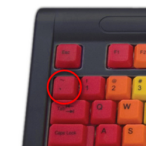

# Writing Good Documentation

## Step 1 - Using Codeblocks

Codeblocks in Markdown make it _very easy_ for tech people to **copy, paste, and share** code.

A good **Cloud Engineer** uses Codeblocks whenever possible.

Because it allows others to copy and paste their code to replcate or research issues.

* In order to create Codeblocks in Markdown you need to use three backticks ( ` ).
* Not to be confused with single quotes ( ' ).
* Codeblock example:

```
def factorial(n)
  if n == 0
    return 1
  else
    return n * factorial(n - 1)
  end
end

# Calculate and print the factorial of 5
result = factorial(5)
puts "Factorial of 5 is #{result}"
```

* When you can you should attempt to apply syntax highlighting to your Codeblocks:

```ruby
def factorial(n)
  if n == 0
    return 1
  else
    return n * factorial(n - 1)
  end
end

# Calculate and print the factorial of 5
result = factorial(5)
puts "Factorial of 5 is #{result}"
```

- Make note of where the _backtick_ key is located.
- It should appear above the _tab_ key, but it may vary based on your keyboard layout.

  

Good Cloud Engineers use codeblocks for both Code and Errors that appear in the console.

```bash
Traceback (most recent call last):
        1: from (irb):1
NameError (undefined local variable or method `undefined_variable' for main:Object)
```

> Here is an example of using a codeblock for an error that appears in _bash_.

## Step 2 - How to Take Screenshots

A screenshot is when you cpature a part of your screen from your laptop, desktop, or phone.

This is not to be confused with taking a photo of your screen with your phone.

When you can, always provide a Codeblock instead of a screenshot.

If you need to take a screenshot, make sure it's not a photo from your phone.

> There are certain cases where it's okay to take photos with your phone. This is when you are showing something like a keyboard, which does not appear on a computer screen. If it renders on your computer screen it should be a screenshot.

***DON'T DO THIS!***


This is what a screenshot from your computer should look like.

***DO THIS INSTEAD!***


### Screenshot Instructions

You can take screenshots on both Mac and Windows using hotkeys. Here are the commonly used hotkeys for taking screenshots on each operating system:

**For Mac:**

1. **Capture the Entire Screen:**
   - Press `Command (⌘) + Shift + 3` to capture the entire screen.
   - The screenshot will be saved to your desktop by default.

2. **Capture a Selected Portion of the Screen:**
   - Press `Command (⌘) + Shift + 4`.
   - Click and drag to select the portion of the screen you want to capture.
   - Release the mouse button to take the screenshot.
   - The screenshot will be saved to your desktop by default.

3. **Capture a Specific Window:**
   - Press `Command (⌘) + Shift + 4`, then press the `Spacebar`.
   - Click on the window you want to capture.
   - The screenshot of the selected window will be saved to your desktop by default.

**For Windows:**

1. **Capture the Entire Screen:**
   - Press `PrtScn` (Print Screen) to capture the entire screen.
   - The screenshot will be copied to your clipboard.

2. **Capture the Active Window:**
   - Press `Alt + PrtScn` to capture only the active window.
   - The screenshot will be copied to your clipboard.

3. **Capture a Selected Portion of the Screen (Windows 10 and later):**
   - Press `Windows + Shift + S` to open the Snipping Tool or Snip & Sketch tool.
   - Click and drag to select the portion of the screen you want to capture.
   - The screenshot will be copied to your clipboard.

4. **Capture the Entire Screen (Windows 10 and later):**
   - Press `Windows + Shift + S`, then press `Enter` to capture the entire screen.
   - The screenshot will be copied to your clipboard.

After taking a screenshot, you can paste it into an image editor or document by pressing `Ctrl + V` (Windows) or `Command (⌘) + V` (Mac).

Please note that the specific hotkeys and methods may vary slightly depending on your Windows version. The methods mentioned here are applicable to Windows 10 and later versions.

## Step 3 - Use GitHub Flavored Task Lists

GitHub extends Markdown to have a list where you can check off items. [<sup>[1]</sup>](#external-references)

* [x] Finish Step 1.
* [ ] Finish Step 2.
* [X] Finish Step 3.

## Step 4 - Use Emojis (Optional)

GitHub Flavored Markdown (GFM) supports emoji shortcodes.

Here are some examples:

| Name | Shortcode | Emoji |
| --- | --- | --- |
| Cloud | `:cloud:` | :cloud: |
| Cloud with Lightning | `:cloud_with_lightning:` | :cloud_with_lightning: |

## Step 5 - How to Create a Table

You can use the following Markdown format to create tables:

```markdown
| Name | Shortcode | Emoji |
| --- | --- | --- |
| Cloud | `:cloud:` | :cloud: |
| Cloud with Lightning | `:cloud_with_lightning:` | :cloud_with_lightning: |
```

GitHub extends the functinality of Markdown tables to provide more alignment and table cell formatting options. [<sup>[2]</sup>](#external-references)

* Make note of where the _pipe_ key is located.
* It should appear above the _return_ or _enter_ key, but it may vary based on your keyboard layout.

  

[Secret Window Hidden Garden](secret-window/hidden-garden.md)

## External References

* [GitHub Flavored Markdown spec](https://github.github.com/gfm)
* [Basic writign and formatting syntax (GFM)](https://docs.github.com/en/get-started/writing-on-github/getting-started-with-writing-and-formatting-on-github/basic-writing-and-formatting-syntax)
* [GFM - Task Lists](https://docs.github.com/en/get-started/writing-on-github/getting-started-with-writing-and-formatting-on-github/basic-writing-and-formatting-syntax#task-lists) <sup>[1]</sup>
* [GFM - Emoji Cheat Sheet](https://github.com/ikatyang/emoji-cheat-sheet)
* [GFM - Tables (with extensions}](https://github.github.com/gfm/#tables-extension-) <sup>[2]</sup>

:end:
